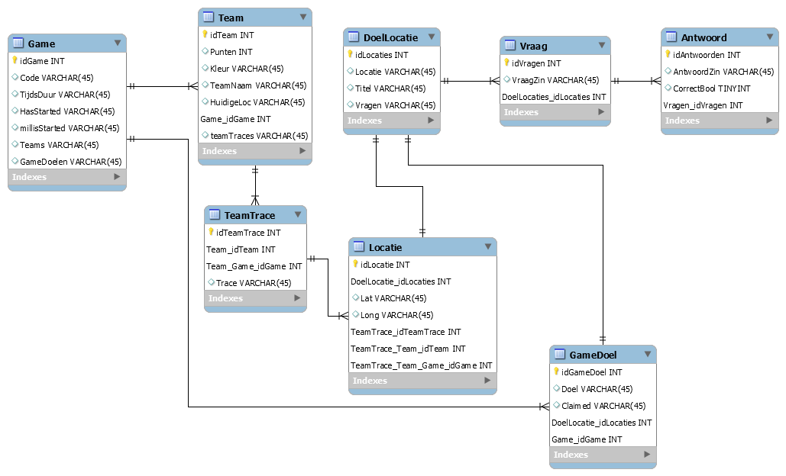

# Documentatie CityCheck

## City Check - analyse & Sprint 01

### Spelers
* 2+ teams
* 1 of meer personen per team

### Tijdsduur
* 1-4 uur

### Doel
* Meest mogelijke punten verzamelen
* Andere teams saboteren
* Meest strategische route proberen uit te werken
* Doellocaties claimen

### Werking van spel
* Start op dezelfde locatie met 30 punten
* Vanaf bepaalde afstand van elkaar de game start
* Vanaf dat punt wordt het traject gevolgd op een "Snake"-achtige manier (GPS en netwerk functionaliteit moeten enabled zijn)
* 3 random locaties worden gegeven door de app bij start, relevant aan omgeving en trekpleisters en updaten over tijd naarmate de wedstrijd vordert

#### Puntensysteem
* Per geclaimde locatie wordt er beloon met punten. 10 voor een claim zonder bonusvraag, 20 bij een correcte bonus vraag, maar slechts 5 als de risico bonusvraag op een locatie foutief is!
* Kruisen de trajecten elkaar op enig punt, dan worden er 5 punten afgetrokken van het team dat het traject kruist

## User stories
[Zie Jira voor uitgewerkte versie.](https://jira.ap.be/secure/RapidBoard.jspa?rapidView=230&projectKey=CA18CC&view=planning.nodetail)

### Sprint #1
We beginnen met de creatie van de eerste schermen.
Dit is het begin om teams en een spel te kunnen aanmaken via een gebruiksvriendelijke ui.
Alsook moeten we gebruik gaan maken van de Google Maps API om hun map te verwerken in ons spel view (in-game scherm).

#### Uitwerking user stories binnen sprint #1

**Story 1**
##### Description

Dit gaat een simpel selectiescherm zijn met de mogelijkheid om te kiezen tussen 2 knoppen, het aanmaken van een game en het joinen van
een game.
Als een game aanmaken word gekozen gaat men naar het volgende scherm. Hier komt men eerst bij een disclailmer pagina met wat extra info om dan door verwezen te worden naar de effectieve pagina. Om spelers te kunnen uitnodigen dmv een automatich gegenereerde passcode.

##### Sub tasks

* UI opmaken vanuit mockups naar xml voor een gebruiksvriendelijke werking
* UI voorzien van achterliggende werking (buttons code, ...)
* Game class object kunnen aanmaken via de frontend
* Communicatie functies voorzien om spel data te versturen en op te vragen met de backend
* Tabellen opmaken voor data in te bewaren in de backend om een spel te maken
* Opzetten van een ASP.NET Core API om communicatie mogelijk te maken via http calls
* Omzetten van de spel tabellen naar model classes voor het entity framework
* Opstellen van een controller om functionaliteit en communicatie te voorzien

**Story 2**
##### Description

Dit gaat een simpel selectiescherm zijn met de mogelijkheid om te kiezen tussen 2 knoppen, het aanmaken van een game en het joinen van
een game.
Als het joinen van een game wordt gekozen gaat op het volgende scherm. Er gaat gevraagd worden om 
1) Een team naam in te geven. 
2) Een team kleur te kiezen 
3) Een code in te geven die gegenereerd is bij de persoon die de huidige game heeft aangemaakt.
Als deze code juist wordt ingevoerd gaat men de mogelijkheid krijgen om naar de volgende pagina doorverwezen te worden.

##### Sub tasks

* UI opmaken vanuit mockups naar xml voor een gebruiksvriendelijke werking
* UI voorzien van achterliggende werking (buttons code, ...)
* Team class object kunnen aanmaken via de frontend
* Communicatie functies voorzien om team data te versturen en op te vragen met de backend
* Tabellen opmaken voor data in te bewaren in de backend om een team te maken
* Omzetten van de team tabellen naar model classes voor het entity framework
* Opstellen van de controller functionaliteit voor een team aan te maken

**Story 3**
##### Description

Op het moment dat een game wordt gestart krijgen alle spelers de map te zien met de eerste doelen random aangeduid op de map.

##### Sub tasks

* UI opmaken vanuit mockups naar xml voor een gebruiksvriendelijke werking
* Inwerking Google Maps API in de app
* Map instellen op een overzicht van het speeldomein (Antwerpen) (border)

# Algemene Documentatie

## Mockups
Beginscherm voor en na het aanmaken van het spel:

Aanmaken en beheren van een spel:

Team aanmaken en deelnemen aan een spel:

Kaart tijdens het spel een vraag op een locatie:

 

Einde spel:

## Architectuur

### Front-End
* Native android APP
	* XML,JAVA,GSON/JSON,...
* Google maps API
* Angular admin app
* Sensor aanspraak (GPS) (binnen Android Java)
* Retrofit API client

### Back-End
* ASP.NET Core 2.1 framework (incl entity framework)
* Raspberry pi hosting (incl port forwarding)
* MySql Server

### Data model

---

### Architectuur
- Native Android App
XML, Java, GSON/JSON, ...
- Angular Admin Web App
- Google Maps API & Location API
- Sensor Aanspraak (GPS) (binnen Android Java)
- Retrofit API Client
High level client

### Frontend App

### Frontend Admin

### Backend

### Deployment

### Mobile APP

Mobiele applicatie launched (als gesloten beta) op de google play store. Beschikbaar voor download door de spelers.

### Admin Web App

Web app gehost via firebase hosting op een gratis aangemaakt . tk domain.
Via cmd stel je je firebase gegevens in, hierna maak je een production build van de applicatie. Deze plaats je in een folder samen met het firebase json bestand (enkeel settings) en hierop kan je dan firebase deploy uitvoeren om je nieuwe versie te launchen.

### Backend

De backend wordt gehost op een raspberry pi 3B. Hierop hebben we een mysql server staan, een nginx server om inkomde requests te redirecten naar de localhost op poort 5000 om de pai te kunnen bereiken. De communicatie over de gebruikte poort is op het thuisnetwerken dan ook open gezet via port forwarding.

### Code Guidelines
-   Gebruik Solid Principles
    
-   Camel Case
    
-   public -> hoofdletter
    
-   private -> kleine letter
    
-   classes per verantwoordelijkheid
    
-   code overzichtelijk houden door op te splitsen in methoden
    
-   Repeating code vermijden (gebruik methods, classes, ...)
    
-   variabelen en methodes private en enkel als het echt nodig is andere access modifier

(Gedeeltelijk) herhalende variabelen globaal gebruiken. (= geen herhaling):

### Version Control

-   Branches per onderdeel.
    
-   Development op feature branches
    
-   Merging naar onderdeel-branch
    
-   Samenvoeging eindproduct in master branch

### Testing

Alsook testing op de meest gevoelige, belangrijke, ... Functies binnen de frontend app en de backend solution zin aanwezig in het project.
Enkele voorbeelden van de reeks unit tests:

### Team Collaboration

-   2 weken sprints
    
-   Samen bespreken waar we mee bezig zijn
    
-   Errors bekijken en samen oplossen
    
-   Samen bespreken wat er een volgende sprint kan gebeuren
    
-   Samen bekijken of vooropgestelde plan nog steeds goed is of eventueel aanpassingen doen voor een betere flow te krijgen

---
City Check
