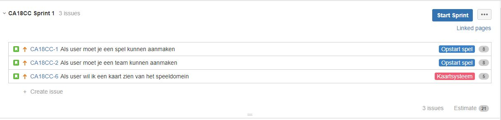
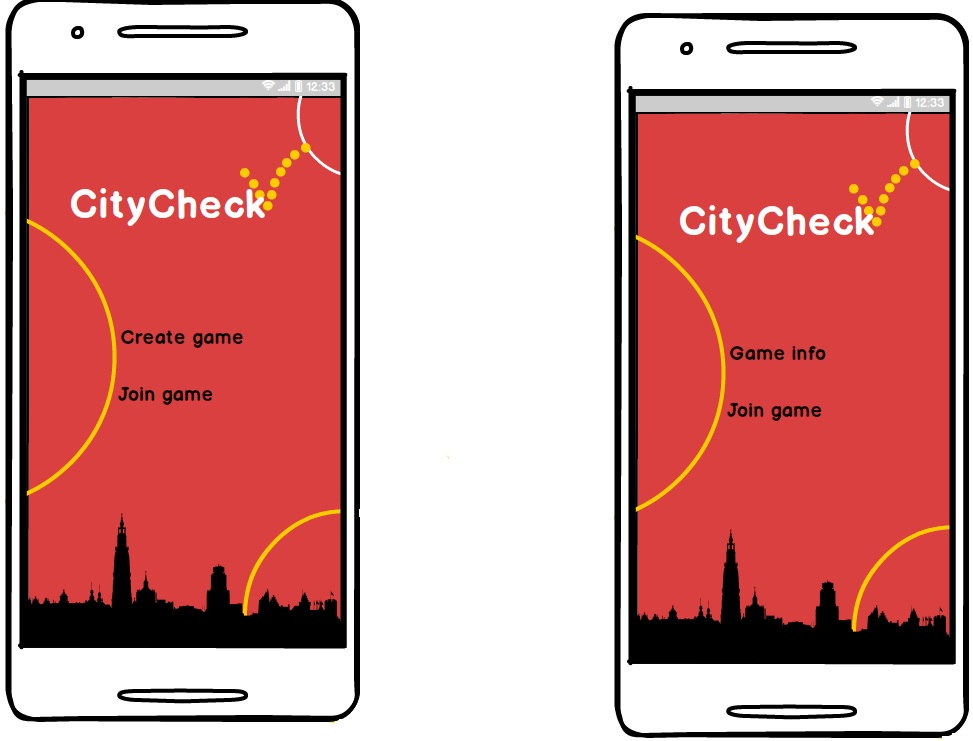
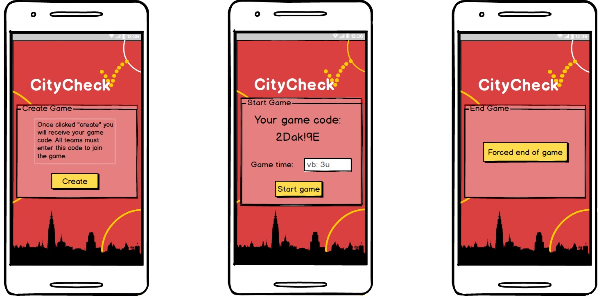
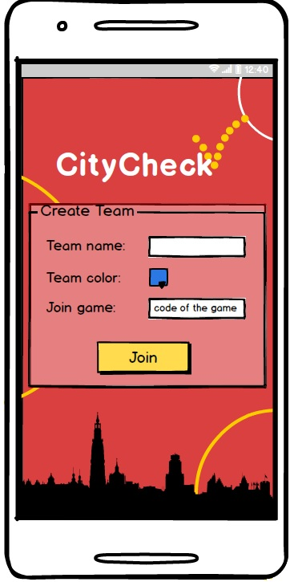
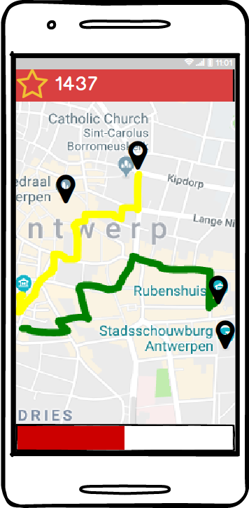
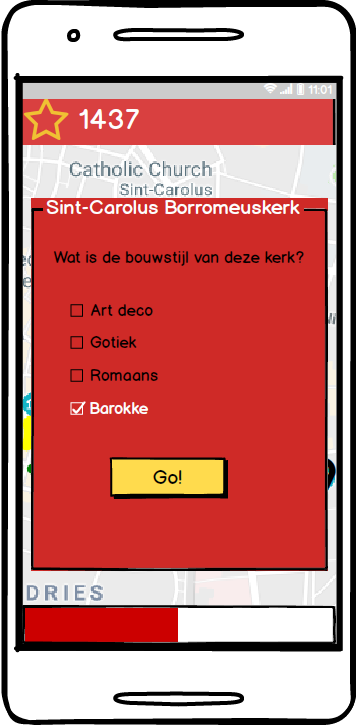
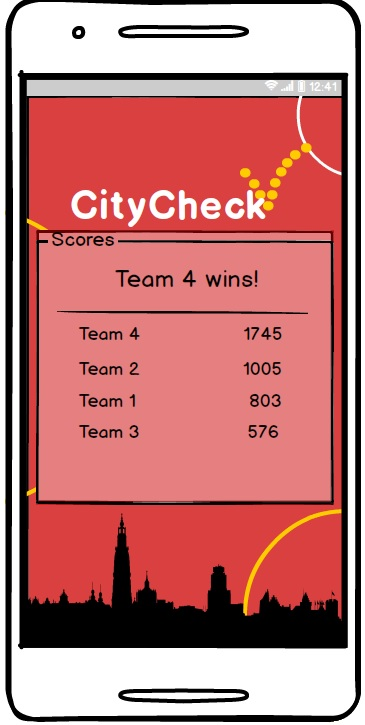

# City Check analyse

## Beschrijving

### Spelers
* 2+ teams
* 1 of meer personen per team

### Tijdsduur
* 3 uur (kan veranderen)

### Doel
* Meest mogelijke punten verzamelen
* Andere teams saboteren
* Meest strategische route proberen uit te werken

### Werking van spel
* Start op dezelfde locatie met x aantal punten
* Vanaf bepaalde afstand van elkaar de game start
* Vanaf dat punt wordt het traject gevolgd op een "Snake"-achtige manier (GPS en netwerk functionaliteit moeten enabled zijn)
* Meerdere random locaties worden gegeven door de app bij start, relevant aan omgeving en trekpleisters (3 of meer, premium en normale locaties om competitie te ondersteunen) en updaten over tijd naarmate de wedstrijd vordert

#### Puntensysteem
* Per bezochte locatie wordt een bepaalde hoeveelheid punten toegekend (afhankelijk van de status van de locatie, premium of normale locatie)
* Kruisen de trajecten elkaar op enig punt, dan wordt een bepaalde hoeveelheid punten afgetrokken van het team dat het traject kruist
* Andere extra spelelementen die de score beïnvloeden kunnen later worden toegevoegd

### Uitbreidingen:
* Trivia vraag over de locatie
	* Juiste antwoord = extra punten voor de team
* Spectator/moderator toegang verschaffen voor veiliger verloop van spel en volgen van groepen
* Recording van game
* Tower defense elementen (nog steeds in concept & optioneel)
	* Blokades (doorbreken groot verlies van punten)
	* Static zone (AOE voor verlies punten)

## User stories
[Zie Jira voor uitgewerkte versie.](https://jira.ap.be/secure/RapidBoard.jspa?rapidView=230&projectKey=CA18CC&view=planning.nodetail)

### Sprint #1
We beginnen met de creatie van de eerste schermen.
Dit is het begin om teams en een spel te kunnen aanmaken via een gebruiksvriendelijke ui.
Alsook moeten we gebruik gaan maken van de Google Maps API om hun map te verwerken in ons spel view (in-game scherm).

#### Uitwerking user stories binnen sprint #1

**Story 1**
##### Description

Dit gaat een simpel selectiescherm zijn met de mogelijkheid om te kiezen tussen 2 knoppen, het aanmaken van een game en het joinen van
een game.
Als een game aanmaken word gekozen gaat men naar het volgende scherm. Hier komt men eerst bij een disclailmer pagina met wat extra info om dan door verwezen te worden naar de effectieve pagina. Om spelers te kunnen uitnodigen dmv een automatich gegenereerde passcode.

##### Sub tasks

* UI opmaken vanuit mockups naar xml voor een gebruiksvriendelijke werking
* UI voorzien van achterliggende werking (buttons code, ...)
* Game class object kunnen aanmaken via de frontend
* Communicatie functies voorzien om spel data te versturen en op te vragen met de backend
* Tabellen opmaken voor data in te bewaren in de backend om een spel te maken
* Opzetten van een ASP.NET Core API om communicatie mogelijk te maken via http calls
* Omzetten van de spel tabellen naar model classes voor het entity framework
* Opstellen van een controller om functionaliteit en communicatie te voorzien

**Story 2**
##### Description

Dit gaat een simpel selectiescherm zijn met de mogelijkheid om te kiezen tussen 2 knoppen, het aanmaken van een game en het joinen van
een game.
Als het joinen van een game wordt gekozen gaat op het volgende scherm. Er gaat gevraagd worden om 
1) Een team naam in te geven. 
2) Een team kleur te kiezen 
3) Een code in te geven die gegenereerd is bij de persoon die de huidige game heeft aangemaakt.
Als deze code juist wordt ingevoerd gaat men de mogelijkheid krijgen om naar de volgende pagina doorverwezen te worden.

##### Sub tasks

* UI opmaken vanuit mockups naar xml voor een gebruiksvriendelijke werking
* UI voorzien van achterliggende werking (buttons code, ...)
* Team class object kunnen aanmaken via de frontend
* Communicatie functies voorzien om team data te versturen en op te vragen met de backend
* Tabellen opmaken voor data in te bewaren in de backend om een team te maken
* Omzetten van de team tabellen naar model classes voor het entity framework
* Opstellen van de controller functionaliteit voor een team aan te maken

**Story 3**
##### Description

Op het moment dat een game wordt gestart krijgen alle spelers de map te zien met de eerste doelen random aangeduid op de map.

##### Sub tasks

* UI opmaken vanuit mockups naar xml voor een gebruiksvriendelijke werking
* Inwerking Google Maps API in de app
* Map instellen op een overzicht van het speeldomein (Antwerpen) (border)

## Mockups
Beginscherm voor en na het aanmaken van het spel:

Aanmaken en beheren van een spel:

Team aanmaken en deelnemen aan een spel:

Kaart tijdens het spel een vraag op een locatie:

 

Einde spel:

## Architectuur

### Front-End
* Native android APP
	* XML,JAVA,GSON/JSON,...
* Google maps API
* Open data antwerpen (API)
* Sensor aanspraak (GPS) (binnen Android Java)

### Back-End
* ASP.NET Core 2.0 framework
* AZURE (hosting)